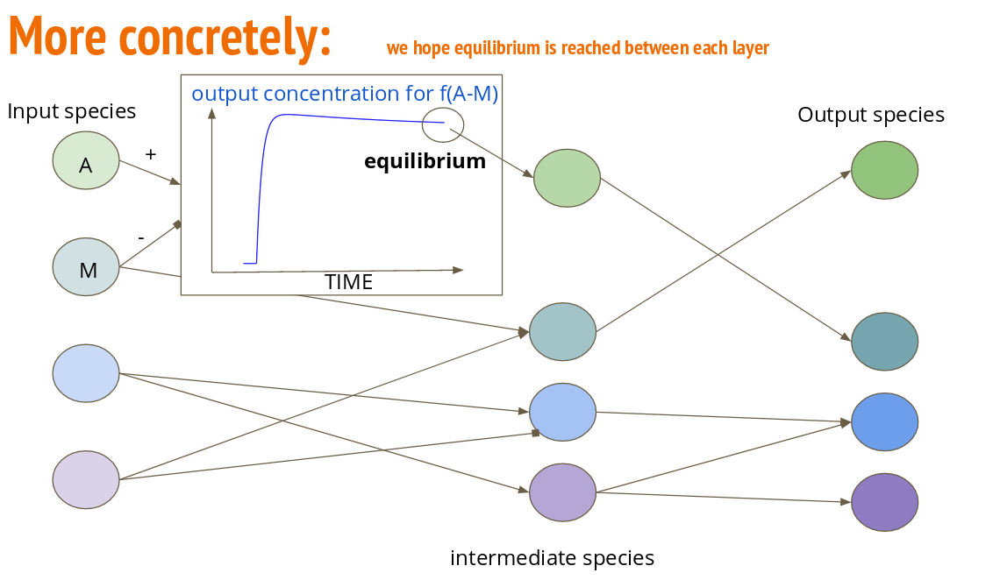
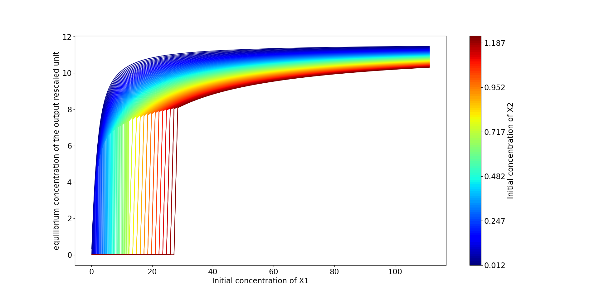
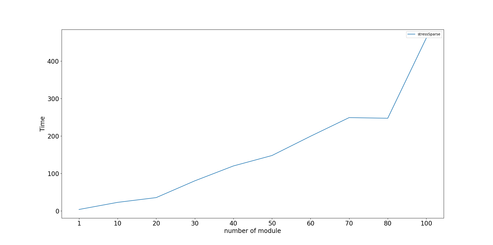
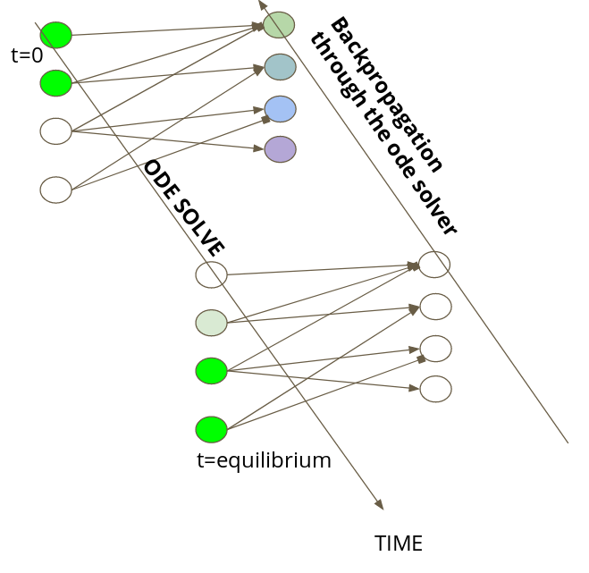

.. BioChemicalNN documentation master file, created by
   sphinx-quickstart on Mon May 27 16:50:35 2019.
   You can adapt this file completely to your liking, but it should at least
   contain the root `toctree` directive.

Welcome to BioChemicalNN's documentation!
=========================================

This project aims at demonstrating that neural network can be used to find and optimize interesting reaction networks.
The project is mainly based on the simulOfBioNN package, on which an introduction can be found in getting started.
As for now the project only supports mass-action solve on the CPU, but will be quickly interfaced with a solve on the GPU.
The paretoPlot package provide an easy way to obtain very fast pareto plot of the performance of a given architecture.

.. toctree::
   :maxdepth: 2
   :caption: Contents:

   simulOfBioNN
   paretoPlot
   gettingStarted

.. epigraph::

   This project aims to propose a coarse-grained approach for the discovering of interesting bio-chemical network.
   Multiple species reacting in a suited environment can be seen as a network of chemical reaction.
   Given some input species, the equilibrium of the chemical reaction, if it exists, give birth to new species.
   If the network is well organized we can understand this final value as the evaluation of a neural network, as one can see in the following image.

   To find such interesting network, we train neural network under special constraints, and test them by simulating mass-action kinetics.
   Our project is separated in two parts: the training part and the simulating one.
   For now ODE are simulating on the CPU using scipy odeint. Network training is made with tensorflow.

.. epigraph::

   Nevertheless, it is also interesting to obtain a simulated value of the concentration of output species at equilibrium as a function of input species.
   To obtain these values, we need to integrate an ODE describing the evolution of species in the system for various input, and fit the function linking input species to output.
   Some example of such simulation, for one activator and one inhibitor acting on an output species can be observed in the following image.

.. epigraph::

   As the number of species in the system increase, the time of simulation on the CPU with our current implementation dramatically increase.
   We therefore need to either improve our implementation or change the computation support from CPU to GPU

.. epigraph::

   As a side-project, or a secon step, we aim at doing everything on to the GPU so that simulation and training can be coupled in a ODE-net fashion approach, enabling us to leave the equilibrium constraints.
   Such improvement will allow us to use the full dynamic.

Indices and tables
==================

* :ref:`genindex`
* :ref:`modindex`
* :ref:`search`
